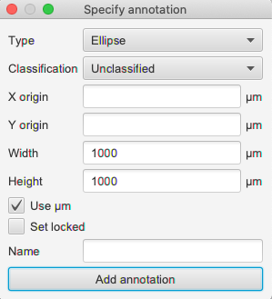

## Tumor budding scripts for QuPath

This repository contains the scripts to assess tumor buds with the open-source software [**QuPath** (http://qupath.github.io)](http://qupath.github.io) first used in the paper:

> Fisher, N. et al. (2021)
> _Development of a semi-automated method for tumor budding assessment in colorectal cancer and comparison with manual methods_.

The scripts are designed for brightfield whole slide images with Pan-Cytokeratin staining (DAB).

### What's here?

There are two main scripts:

* **CK buds in TMAs.groovy**, to identify tumor buds in tissue microarrays (TMAs)
* **CK buds in WSI.groovy**, to identify buds in larger tissue sections.

There is also one additional folder, **classifiers** which contains the thresholding classifiers used in the paper.

### How do I use the scripts?

The scripts were written for QuPath v0.2, which was the current version at the time of the work.

Here we describe how we used each script in the paper.

> QuPath is continually being improved! By the time you read this, there might be a better way to do the analysis using new features in the software.
> You can find current and past QuPath versions at https://github.com/qupath/qupath/releases
> 
> For help using QuPath, please use the community forum at http://image.sc/tag/qupath

#### Using _CK buds in TMAs.groovy_

For a user familiar with QuPath, the steps to use the script are:

* Create a project
* Copy the classifiers into the project
* Open a TMA image and dearray it
* Run the script

For a user less familiar with the software, here's a more detailed step-by-step guide with links [to the QuPath documentation](http://qupath.readthedocs.io):

* Create a new folder on your computer
* Drag the folder onto QuPath to turn it into a QuPath project (see [here](https://qupath.readthedocs.io/en/latest/docs/tutorials/projects.html#create-a-project))
* Copy **classifiers** and **scripts** folders from this repository into the project folder you just created
  * *Do this outside QuPath, e.g. in Windows Explorer*
* Drag your TMA images onto QuPath to import them to the project (see [here](https://qupath.readthedocs.io/en/latest/docs/tutorials/projects.html#add-images))
  * *Select 'Brightfield (H-DAB)' as the image type*
* Within QuPath
  * Double-click on one of your images from the **Project tab** to open it
    * *The Project tab is on the left side of the QuPath window*
  * Run the **TMA &rarr; TMA dearrayer** command to identify TMA cores
    * *At this point you can adjust core locations, or right-click cores to mark them as 'missing'*
  * Run **Automate &rarr; Project scripts... &rarr; CK buds in TMAs**  to open the script in the script editor
  * Choose **Run &rarr; Run** to finally run the script (see [here](https://qupath.readthedocs.io/en/latest/docs/scripting/workflows_to_scripts.html#running-a-script-for-a-single-image))

After some minutes (or seconds), tumor buds should be detected and displayed.

You can then use *Measure &rarr; Show TMA measurements* or *Measure &rarr; Show annotation measurements* to view and export summary results.

> **Important!**
> 
> The pixel size information in µm must be available within your images for the spatial calibration to work properly.
> This impacts both the resolution at which the bud detection is applied, and the size thresholds used to filter out non-buds. See [here](https://qupath.readthedocs.io/en/latest/docs/concepts/images.html#pixel-size-resolution-magnification) for more information.

#### Using _CK buds in WSI.groovy_

This script was used to help generate *Figure 8* in the paper and demonstrate how the TMA methods could be extended to work on larger tissue sections.

To use it, most of the steps are the same as above - except that instead of dearraying a TMA, you should draw annotations instead (see [here](https://qupath.readthedocs.io/en/latest/docs/starting/annotating.html)).

The script will automatically be applied to all annotations on the image, deleting any existing buds along the way.

You have three main options when creating annotations, depending upon how you want to use the script:

1. Use the **Polyline** tool (icon `V`) to draw a line at the tumor margin. The script will automatically expand the line by 1mm in all directions to define a 2mm diameter region at the tumor margin, within which buds are detected.
2. Use any of QuPath's area drawing tools (e.g. **Polygon**, **Brush**, **Wand**) to define an area within which all buds are detected.
3. Use **Objects &rarr; Annotations... &rarr; Specify annotation** to create a circle annotation with a specified diameter (e.g. 1mm). This can be useful to count buds using a standardized protocol within manually-selected regions.

> **Note:** the density map visualization in the figure was generated using a snapshot version of QuPath v0.3.0, while still in development.
> It's planned to include a new command to interactively generate density maps and automatically detect hotspots in the next QuPath release.

### How do I get better results?

Because images acquired in different labs may have a different color or intensity of staining, parameters may well need to be adjusted to get reasonable results elsewere.
We have deliberately kept our approach conceptually simple so that it can be easily adapted to new images.

For more information about customizing the main steps of stain separation and thresholding in QuPath, see

* [Stain separation](https://qupath.readthedocs.io/en/latest/docs/tutorials/separating_stains.html)
* [Thresholding](https://qupath.readthedocs.io/en/latest/docs/tutorials/thresholding.html)
* [Measuring areas](https://qupath.readthedocs.io/en/latest/docs/tutorials/measuring_areas.html)

If you create your own threshold classifier following the instructions above, simply save it within QuPath and update the classifier name in the script to match.

The main extra tasks carried out within the scripts are to

1. Apply size filters to identify and remove non-buds
2. Fill holes within larger CK-positive areas, so as to be able to exclude luminal tumor cells or cellular fragments mimicking buds

The most relevant parameters are flagged in the script comments and can be adjusted as needed.

#### Can I exclude false positives based upon criteria other than area?

Yes! QuPath is able to make a range of shape and intensity measurements for every detected (potential) bud.

For example, the *CK buds in WSI.groovy* includes some lines at the end to demonstrate how circularity could be used.

Furthermore, all of the interactive machine learning techniques described in QuPath's [Pixel classification](https://qupath.readthedocs.io/en/latest/docs/tutorials/pixel_classification.html) tutorial can be applied to refine the detection of candidate buds.

Subsequently, the machine learning described in QuPath's [Cell classification](https://qupath.readthedocs.io/en/latest/docs/tutorials/cell_classification.html) tutorial can also be applied to candidate buds to better distinguish true positives from false positives.

However, we would warn against introducing extra complexity unnecessarily, since without careful testing and validation it *could* make the analysis method more brittle when applied to new images.

We did not use these techniques because our goal was to establish a baseline end-to-end workflow for bud assessment that is entirely open, freely available for anyone to use, and readily adaptable to different labs with very few adjustments.
This provides a basis for future work.

#### Can't I just click a button instead of using scripts?

Not yet.

Images are so different that developing a method that copes with all the variations in tissue, staining and scanning - not to mention the complexity of defining what exactly should count as a 'tumor bud' - make this a difficult challenge to solve in a general way.

In the future, we hope to work collaboratively to develop more powerful methods of tumor budding assessment that incorporate more sophisticated artificial intelligence techniques, which can be applied at the click of a mouse - while remaining open-source and freely-available.

One of the biggest challenges to this is to assemble a sufficiently large and diverse collection of tumor bud images that are compatible with open-source licensing for any developed algorithm.
*If you are able to help with this, please let us know!*

### How do I cite this work?

If you use QuPath in your work, please cite the main QuPath paper - see [Citing QuPath](https://qupath.readthedocs.io/en/latest/docs/intro/citing.html) for details.

If you used these scripts, please also cite the budding paper included at the top of this page.

### License

The scripts are made available under MIT license.

QuPath is available under the GPL v3; for up-to-date information see https://github.com/qupath/qupath
